# Xavier Lau

- GitHub: [aurexav](https://github.com/aurexav) | [hack-ink](https://github.com/hack-ink)
- LinkedIn: [Xavier Lau](https://www.linkedin.com/in/xavier-lau-b0655310a)
- Nationality: China | Hong Kong

## Profile

7 years of Rust development, 5 years of blockchain core development, and 1 year of AI research and application experience. Actively engaged in the Polkadot ecosystem with end-to-end expertise from protocol design, cross-chain bridge implementation, to mainnet operations. Significant influence in the open-source community with multiple widely adopted Rust libraries. Recently focused on applying AI Agents in Web3 intelligence and data systems.

## Key Achievements

- **Polkadot Fellowship Member** (ecosystem technical contributor)
- **Polkadot Stack Exchange Moderator**, Top 1–3 for 3 consecutive years: [profile](https://substrate.stackexchange.com/users/251/aurexav)
- Independently developed and maintained a stable public blockchain: [Darwinia](https://github.com/darwinia-network/darwinia)
- Developed the first **Ethereum↔Substrate Crosschain Bridge** in the Polkadot ecosystem
- Led seamless migration from **Solochain → Parachain** (mainnet upgrade)
- Independently completed **3 W3F Grants**: [projects index](https://github.com/hack-ink)
- Created the first Rust miner for **Bitcoin Atomicals Protocol**, achieving multi-fold efficiency gains; community GPU miner was built upon it: [atomicalsir](https://github.com/hack-ink/atomicalsir)
- Rust array encoding library [array-bytes](https://github.com/hack-ink/array-bytes): used by 9,000+ projects, 8,000,000+ downloads on crates.io
- Rust string escaping library [unescaper](https://github.com/hack-ink/unescaper): used by 2,000+ projects, 6,000,000+ downloads on crates.io; adopted by OpenZeppelin, Stackware, GreptimeDB, probe-rs, serialport
- **AI Agentic Crypto/DeFi Intelligence System**: autonomous intelligence gathering and analysis from on-chain and exchange data sources (self-developed)

## Work Experience

### [Itering Tech](https://www.linkedin.com/company/itering/posts/?feedView=all)

#### 2025 – Present | [Helixbox Team](https://github.com/helixbox) | AI Agent Research

- Researched and implemented AI Agent frameworks for the crypto industry, building pipelines for multi-source data collection, aggregation, and intelligence generation.
- Developed intelligent coordination mechanisms for on-chain event parsing, protocol change tracking, and risk alerts.

#### 2024 – 2025 | [Subscan Team](https://github.com/subscan-explorer) | Data Analysis

- Improved blockchain explorer metric systems and query performance; enhanced cross-chain and ecosystem data aggregation views.
- Established data quality validation and automated reporting processes to support analytical insights.

#### 2020 – 2024 | [Darwinia Team](https://github.com/darwinia-network) | Blockchain Development

- Led core module and cross-chain bridge development and maintenance for [Darwinia](https://github.com/darwinia-network/darwinia) blockchain.
- Directed the migration from Solochain to Parachain, ensuring stable mainnet upgrades.
- Maintained node and on-chain operational stability, iterating consensus, network, and storage implementations.

## Open Source & Community

- GitHub contributions: [aurexav](https://github.com/aurexav) | [hack-ink](https://github.com/hack-ink)
- Polkadot Stack Exchange: Moderator / Top contributor ([profile](https://substrate.stackexchange.com/users/251/aurexav))
- Representative projects:
  - [array-bytes](https://github.com/hack-ink/array-bytes) (array encoding)
  - [unescaper](https://github.com/hack-ink/unescaper) (string escaping)
  - [atomicalsir](https://github.com/hack-ink/atomicalsir) (Bitcoin Atomicals Rust miner)
  - Other W3F grants and tools: [overview](https://github.com/hack-ink)

## Professional Skills

- Bitcoin Ecosystem
- Polkadot Ecosystem
- Crosschain Bridge (ETH <> Polkadot, OP Rollup)
- Blockchain Consensus
- Staking
- Security Audit
- DevOps

## Additional Skills

- Memory injection, application reverse engineering & unpacking
- Game engine reverse engineering (data unpacking, ray tracing, Rust version)
- Embedded development (Rust version)
- Web scraping (packet capture, API reverse engineering, Rust version)
- AI image generation (Stable Diffusion, LoRA)
- AI vision (object detection, image segmentation, YOLO/ONNX/CUDA/TensorRT, Rust version)
- Computer hardware maintenance & simulation

## Education & Languages

- Bachelor of Computer Science and Technology
- English proficiency: B2–C1

## Metrics

