# Xavier Lau

[English Version](./README.md)

- GitHub：[aurexav](https://github.com/aurexav) | [hack-ink](https://github.com/hack-ink)  
- LinkedIn：[Xavier Lau](https://www.linkedin.com/in/xavier-lau-b0655310a)  
- 国籍：中国 | 香港

## 个人简介

7 年 Rust 开发经验，5 年区块链核心研发经验，1 年 AI 研究与应用经验。长期活跃于 Polkadot 生态，具备从协议设计、跨链桥实现到主网运维的全流程能力。在开源社区有较大影响力，多款 Rust 库被广泛采用。近年来专注于将 AI Agent 应用于 Web3 情报与数据系统。

## 代表性成就

- **Polkadot Fellowship Member**（生态技术贡献者）
- **Polkadot Stack Exchange Moderator**，连续 3 年排名 Top 1–3：[个人主页](https://substrate.stackexchange.com/users/251/aurexav)
- 独立开发并长期维护稳定运行的公链：[Darwinia](https://github.com/darwinia-network/darwinia)
- 开发了 Polkadot 生态首个 **Ethereum↔Substrate 跨链桥**
- 主导 **Solochain → Parachain** 的无缝迁移（主网升级）
- 独立完成 **3 项 W3F Grants**：[项目索引](https://github.com/hack-ink)
- 开发 **Bitcoin Atomicals Protocol** 首个 Rust Miner，实现多倍效率提升；社区 GPU Miner 基于此实现：[atomicalsir](https://github.com/hack-ink/atomicalsir)
- Rust 数组编码库 [array-bytes](https://github.com/hack-ink/array-bytes)：被 9,000+ 项目引用，crates.io 下载量 8,000,000+
- Rust 字符串转译库 [unescaper](https://github.com/hack-ink/unescaper)：被 2,000+ 项目引用，crates.io 下载量 6,000,000+，被 OpenZeppelin、Stackware、GreptimeDB、probe-rs、serialport 等采用
- **AI Agentic Crypto/DeFi 情报系统**：自主研发的链上与交易所多源数据自动化情报采集与分析系统

## 工作经历

### Itering

#### 2025 – 至今 | [Helixbox Team](https://github.com/helixbox) | AI Agent 研究

- 研究并实现面向加密行业的 AI Agent 框架，构建多源数据采集、聚合与情报生成流程  
- 开发链上事件解析、协议变更追踪与风险告警的智能协调机制  

#### 2024 – 2025 | [Subscan Team](https://github.com/subscan-explorer) | 数据分析

- 优化区块链浏览器指标体系与查询性能，增强跨链与生态数据的聚合视图  
- 建立数据质量校验与自动化报表流程，支撑分析与洞察输出  

#### 2020 – 2024 | [Darwinia Team](https://github.com/darwinia-network) | 区块链开发

- 主导 [Darwinia](https://github.com/darwinia-network/darwinia) 公链核心模块与跨链桥的研发与维护
- 规划并执行 Solochain 向 Parachain 的迁移，确保主网平稳升级  
- 维护节点与链上运行稳定性，迭代共识、网络与存储相关实现  

## 开源与社区

- GitHub 贡献：[aurexav](https://github.com/aurexav) | [hack-ink](https://github.com/hack-ink)  
- Polkadot Stack Exchange：版主 / Top 贡献者（[个人主页](https://substrate.stackexchange.com/users/251/aurexav)）  
- 代表性项目：  
  - [array-bytes](https://github.com/hack-ink/array-bytes)（数组编码）  
  - [unescaper](https://github.com/hack-ink/unescaper)（字符串转译）  
  - [atomicalsir](https://github.com/hack-ink/atomicalsir)（Bitcoin Atomicals Rust Miner）  
  - 其他 W3F Grants 与工具：[overview](https://github.com/hack-ink)  

## 职业技能清单

- Bitcoin Ecosystem  
- Polkadot Ecosystem  
- Crosschain Bridge  
- Blockchain Consensus  
- Staking  
- Security Audit  
- DevOps  

## 业余技能清单

- 内存注入、应用逆向与脱壳  
- 游戏引擎逆向（数据解包、光线追踪，Rust 版本）  
- 单片机开发（Rust 版本）  
- 爬虫（抓包、API 逆向，Rust 版本）  
- AI 绘图（Stable Diffusion、LoRA）  
- AI 视觉（目标检测、图像分割，YOLO/ONNX/CUDA/TensorRT，Rust 版本）  
- 计算机硬件（维护与仿真）  

## 教育与语言

- 计算机科学与技术学士
- 英语水平：B2–C1  

## Metrics

